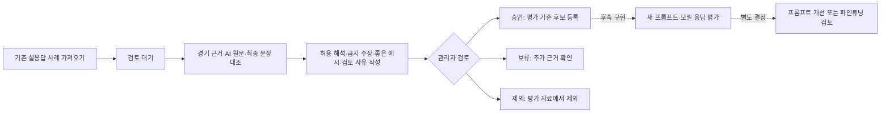

# AI 코칭 품질 관리

관리자 대시보드의 **AI 코칭 품질** (`/admin/ai-coaching`)에서 관리합니다.

## 자료와 범위

- `seed.json`: KangHeeSung_, MiaeQ_Q, What12_9oing_on의 기존 실응답 15개. 개별 경기 6개(착한맛/매운맛), 최근 10경기 토론 3개, 스쿼드 6개(착한맛/매운맛).
- 실제 Gemini 응답 수집: 2026-09-08T09:41:54.050Z. 후처리 재생 검증: 2026-09-08T11:12:33.607Z.
- 원본 검증 보고서: 로컬 `tmp/three-user-validation/release-fixes/report.json`. 보고서는 원본 계정·경기 식별자를 포함하므로 저장소에 추가하지 않습니다.
- fixtureHash: `cd671e220a544f121074baf856a02b46f3bf8d7e024167158e8557962eb058c0`
- 캐시 버전: `2026-09-08.debate-verdict-consistency-v18`.
- `original_response`/`displayed_response`는 JSON의 코칭 문장을 읽기 쉬운 한국어 항목으로 펼친 내용입니다. 전체 원본 JSON 보관 기능은 아닙니다. 칭호·칭호 설명·팀원 닉네임을 포함하고, 최근 분석은 최종 cards만 표시해 호환용 debateIssues와 중복되지 않게 했습니다.
- 경기 근거는 검증 보고서의 수치·범위를 발췌합니다. 포함되지 않은 수치나 장면은 원본 검증이 필요합니다. 최근 10경기는 기능 범위 이름이며, 실제 포함된 동일 조건 경기 수는 각 근거에 별도 표시합니다.
- 실제 닉네임은 사용자 요청대로 유지합니다. 자료는 관리자만 읽고 수정할 수 있습니다.
- 최초 review는 검토용 초안입니다. AI가 작성한 기존 문장이 좋은 코칭의 정답이라고 확정된 상태가 아닙니다.

## 저장·권한

`ai_coaching_review_cases`는 RLS와 권한 회수로 비회원·일반 회원의 직접 접근을 차단합니다. API에서 로그인과 관리자 역할을 확인한 뒤 서버 service-role 클라이언트를 사용합니다. 저장 RPC는 관리자 역할을 다시 확인하며 revision 비교, 내용 저장, 이력 추가를 한 번에 수행합니다. 동시 수정은 409를 반환하고 작성 중인 내용을 유지합니다.

가져오기는 source_key 충돌 시 건너뛰므로 반복해도 기존 승인·교정·이력이 초기화되지 않습니다. 승인에는 네 항목이 모두 필요하고 보류/제외에는 사유가 필요합니다. 승인 이후 교정안 저장은 검토 대기로 되돌립니다.

현재 구현은 수동 검토와 평가 기준 등록까지입니다. 운영 응답 자동 수집, 평가 실행, 자동 배포, 파인튜닝은 연결하지 않았습니다. 이 기능은 Gemini를 호출하지 않습니다.

## 검증

- `npx vitest run tests/ai-coaching-review.test.ts tests/ai-coaching-review-api.test.ts tests/ai-coaching-review-ui.test.ts`
- `npm run verify:core`
- `npm run test:unit -- --maxWorkers=2`
- `npm run build`
- 실제 DB: RLS/권한, 원자적 승인·이력, stale revision, 관리자 재검증을 롤백 트랜잭션으로 확인.
- 실제 SDK: 15개 pending 가져오기 후 재가져오기 0개, 초기 revision/이력 확인.
- 브라우저: 실제 컴포넌트에 모의 API를 연결해 375×667, 390×844, 430×932 및 1440×1000에서 검토·승인·이력과 가로 넘침 확인. 임시 QA 경로는 검증 후 삭제. 실제 로그인 세션의 브라우저 저장 검증은 수행하지 않았습니다.

2026-09-08 검증 결과: 집중 테스트 37개, 전체 테스트 2,618개 통과(76개 기존 조건부 skip). verify:core는 타입 오류 없이 통과했고 기존 ESLint 경고 41개가 남아 있습니다. 프로덕션 빌드 통과. 첫 기본 병렬 전체 실행에서 기존 stat-search-baseline의 fetch 횟수 검증 1건이 실패했으며, 해당 테스트 단독 실행과 maxWorkers=2 전체 재실행은 통과했습니다. 이 테스트의 간헐적 실패 원인은 이번 작업에서 확정하지 않았습니다.
